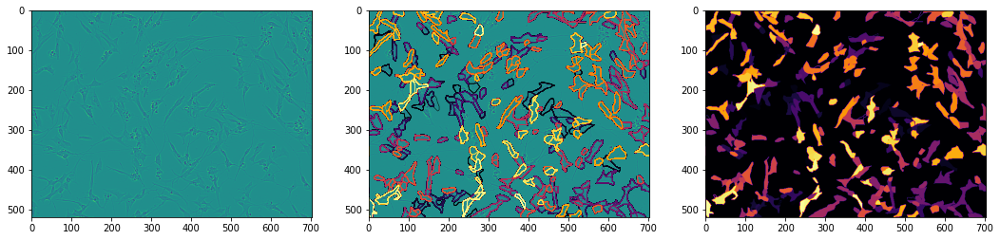
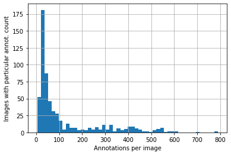

# Kaggle: [Cell Instance Segmentation](https://www.kaggle.com/c/sartorius-cell-instance-segmentation)

[](https://github.com/Borda/kaggle_cell-inst-segm/actions/workflows/ci_testing.yml)
[](https://github.com/Borda/kaggle_cell-inst-segm/actions/workflows/code-format.yml)
[](https://codecov.io/gh/Borda/kaggle_cell-inst-segm)
[](https://results.pre-commit.ci/latest/github/Borda/kaggle_cell-inst-segm/main)

The goal of this challenge is to detect cells in microscope images.



with simple view on how many cels have been annotated per image:



## Experimentation

### install this tooling

A simple way how to use this basic functions:

```bash
! pip install https://github.com/Borda/kaggle_cell-inst-segm/archive/refs/heads/main.zip
```

### run notebooks in Kaggle

- [🦠Cell Instance Segm: 🔍 interactive data browsing](https://www.kaggle.com/jirkaborovec/cell-instance-segm-interactive-data-browsing)
- [🦠Cell Instance Segm. ~ Lightning⚡Flash](https://www.kaggle.com/jirkaborovec/cell-instance-segm-lightning-flash)

### local notebooks

- TBD
-

### some results

Training progress with EfficientNet3D with training  for 10 epochs > over 96% validation accuracy:


